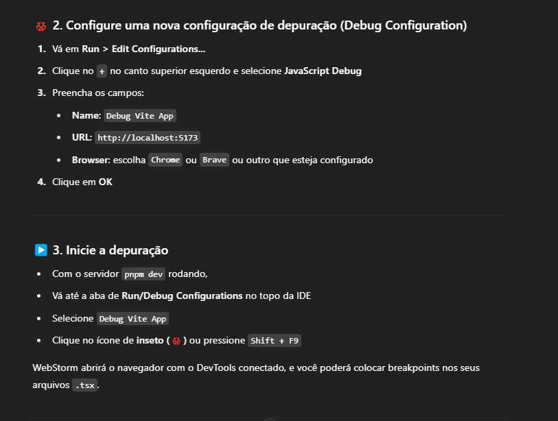
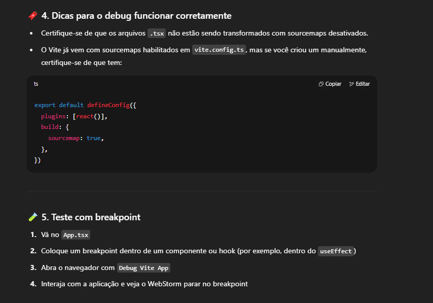

# React-Estudos

# Comandos úteis:

* `pnpm create vite my-react-app -- --template react-ts`: Comando para criar uma aplicação base em REACT usando typescript

# Links uteis

* `React Developer Tools`: https://react.dev/learn/react-developer-tools

## Configurando debug no WebStorm

